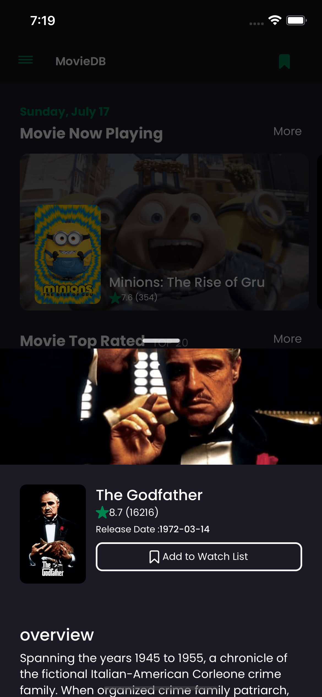

# React Native XMMDBX

## Screenshots

    
    
    
    
    
    
    
    

## Prerequisites

- [Node.js > 12](https://nodejs.org) and npm
- [Watchman](https://facebook.github.io/watchman)
- [Xcode 12](https://developer.apple.com/xcode)
- [Cocoapods 1.10.1](https://cocoapods.org)
- [JDK > 11](https://www.oracle.com/java/technologies/javase-jdk11-downloads.html)
- [Android Studio and Android SDK](https://developer.android.com/studio)

## Base dependencies

- [react-native-modalize](https://github.com/jeremybarbet/react-native-modalize) for bottom modal.
- [react-native-bootsplash](https://github.com/zoontek/react-native-bootsplash) for splash screen.
- [axios](https://github.com/axios/axios) for networking.
- [react-navigation](https://reactnavigation.org/) navigation library.
- [react-native-gesture-handler](https://github.com/software-mansion/react-native-gesture-handler) gesture library.
- [react-i18next](https://react.i18next.com/) for string localization.
- [redux](https://redux.js.org/) for state management.
- [moment](https://redux.js.org/) for date formating.
- [react-native-toast-message](https://github.com/calintamas/react-native-toast-message) for toast messaging.
- [jest](https://facebook.github.io/jest/) and [react-native-testing-library](https://callstack.github.io/react-native-testing-library/) for testing.

## Folder structure

This template follows a very simple project structure:

- `src`: This folder is the main container of all the code inside your application.
    - `apis`: Apis folder to store all network function.
    - `assets`: Asset folder to store all images, vectors, etc.
    - `components`: Folder to store any common component that you use through your app (such as a generic button)
    - `configs`: Config to store any common string, etc.
    - `contexts`: Contexts to store any context react.
    - `i18n`: Folder to store the languages files.
    - `navigators`: Folder to store the navigators.
    - `redux`: Folder to store redux.
        - `actions`: Folder to store all action when using redux
          - `NameAction`: Folder action
            - `file_action.ts`: File name Action
        - `reducers`: Folder to store all reducer when using redux
          - `NameReducer`: Folder reducer
            - `file_reducer.ts`: File name reducer
        - `types`: Folder to store all type when using redux in action or reducer
        - `store`: Folder to store all store redux
    - `screens`: Folder that contains all application screens/features.
        - `Screen`: Each screen should be stored inside its folder and inside it a file for its code and a separate one for the styles and tests.
            - `components`
            - `index.js`
    - `types`: Folder that contains the application type / interface.
    - `utils`: Folder to store utilities and components.
    - `App.js`: Main component that starts your whole app.
    - `index.js`: Entry point of your application as per React-Native standards.

## Setup environments

### Installing dependencies

#### Using yarn
`yarn install`

#### Using npm
`npm install`

### Running

#### Using yarn
DEV: `yarn ios` or `yarn android`

PROD: `yarn ios:prod` o `yarn android:prod`

#### Using npm
DEV: `npm run ios` or `npm run android`

PROD: `npm run ios:prod` o `npm run android:prod`

## Generate production version

These are the steps to generate `.apk`, `.aab` and `.ipa` files

### Android

1. Generate an upload key
2. Setting up gradle variables
3. Go to the android folder
4. Execute `./gradlew assemble[Env][BuildType]`

Note: You have three options to execute the project
`assemble:` Generates an apk that you can share with others.
`install:` When you want to test a release build on a connected device.
`bundle:` When you are uploading the app to the Play Store.

For more info please go to https://reactnative.dev/docs/signed-apk-android

### iOS

1. Go to the Xcode
2. Select the schema
3. Select 'Any iOS device' as target
4. Product -> Archive

For more info please go to https://reactnative.dev/docs/publishing-to-app-store
